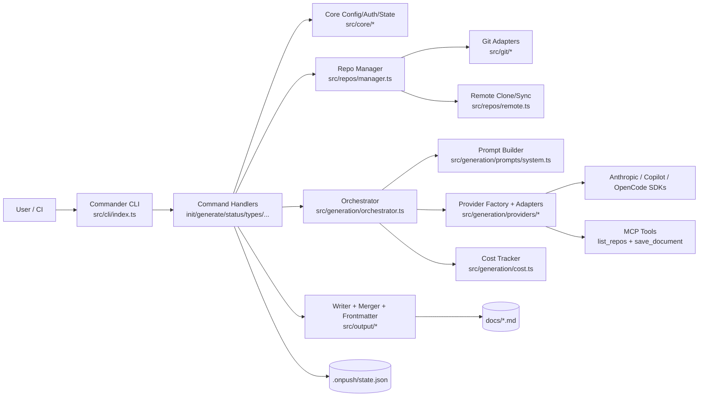
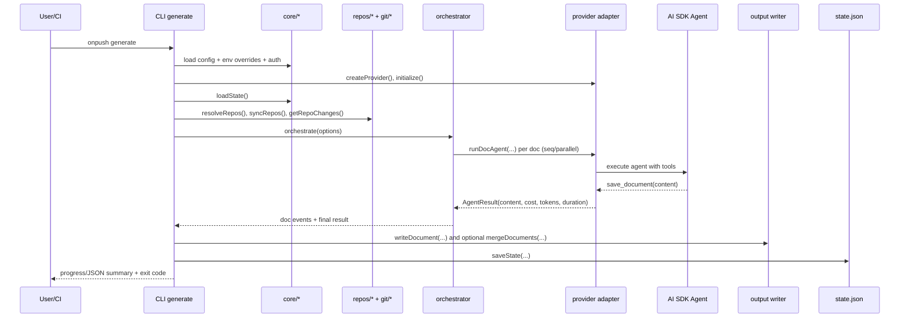
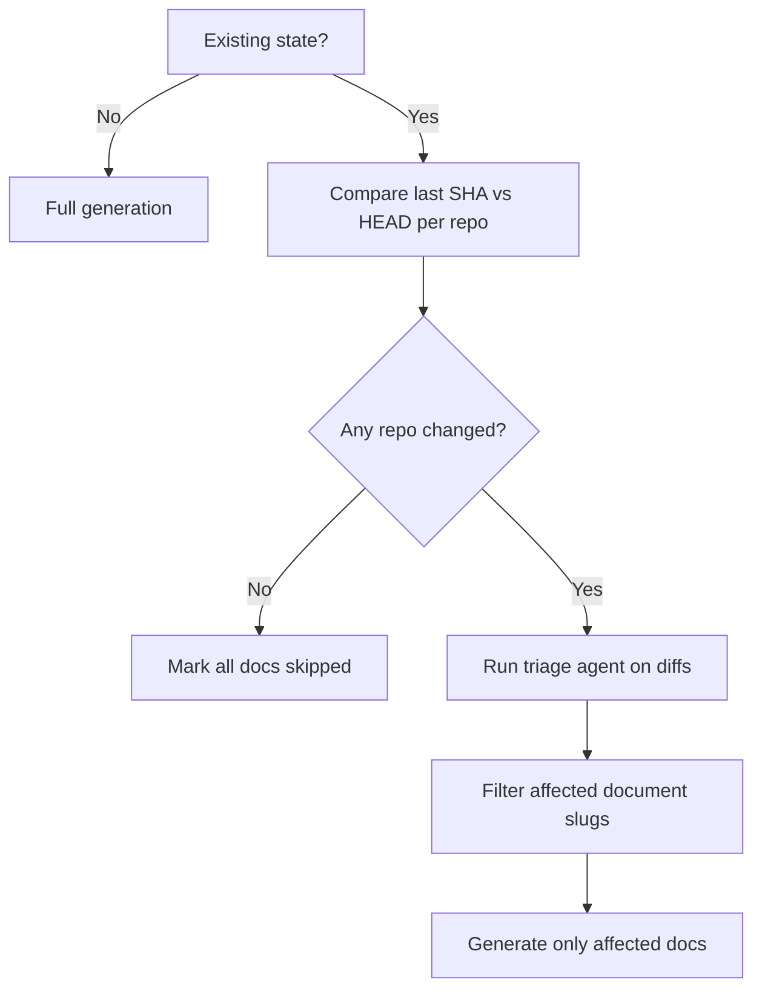

# Architecture / System Design Document

## Table of Contents

- [Architecture Overview](#architecture-overview)
  - [Architecture Style](#architecture-style)
  - [Design Philosophy](#design-philosophy)
- [Component Diagram](#component-diagram)
- [Core Components](#core-components)
  - [CLI Layer](#cli-layer)
  - [Core Domain and Configuration](#core-domain-and-configuration)
  - [Repository and Git Abstractions](#repository-and-git-abstractions)
  - [Generation Orchestration](#generation-orchestration)
  - [Provider Adapters](#provider-adapters)
  - [Output and Persistence](#output-and-persistence)
- [Data Flow](#data-flow)
  - [Primary Flow: `onpush generate`](#primary-flow-onpush-generate)
  - [Incremental Triage Flow](#incremental-triage-flow)
- [System Design Decisions](#system-design-decisions)
  - [Decision Log](#decision-log)
  - [Notable Constraints](#notable-constraints)
- [External Dependencies](#external-dependencies)
- [Scalability & Performance](#scalability--performance)
  - [Scalability Mechanisms](#scalability-mechanisms)
  - [Performance-Critical Paths](#performance-critical-paths)
- [Directory Structure](#directory-structure)

## Architecture Overview

### Architecture Style

OnPush CLI is a **modular monolithic Node.js CLI** with a pluggable AI-provider layer:

- Single deployable artifact (`dist/bin/onpush.js`), no long-running server process (`src/bin/onpush.ts:1`, `src/cli/index.ts:15`).
- Strong module boundaries in `src/` (`cli`, `core`, `generation`, `repos`, `git`, `output`).
- Provider adapter pattern abstracts execution across Anthropic, Copilot, and OpenCode (`src/generation/providers/types.ts:5`, `src/generation/providers/index.ts:3`).
- Event-driven orchestration via async generators for progress, cancellation, and partial-failure handling (`src/generation/orchestrator.ts:78`).

### Design Philosophy

From implementation and prompts, the system emphasizes:

- **Autonomous codebase exploration** by AI agents with constrained write surface (agent can read/search, but final document must be emitted via `save_document`) (`src/generation/agent.ts:99`, `src/generation/tools/repos-tool.ts:42`).
- **Incremental regeneration by default** to reduce cost/runtime via git SHA tracking + triage (`src/repos/manager.ts:115`, `src/generation/orchestrator.ts:110`).
- **Provider portability** through a shared `DocAgentProvider` contract (`src/generation/providers/types.ts:5`).
- **Operational safety** through input validation, path traversal checks, atomic state writes, and repository URL/ref hardening (`src/core/config.ts:17`, `src/output/writer.ts:27`, `src/core/state.ts:141`, `src/repos/remote.ts:17`).

## Component Diagram



## Core Components

### CLI Layer

| Component | Responsibility | Key Interfaces |
|---|---|---|
| `src/bin/onpush.ts` | Binary entrypoint | invokes `run()` |
| `src/cli/index.ts` | Command registration and global options | Commander global flags (`--config`, `--provider`, `--ci`, etc.) |
| `src/cli/commands/generate.ts` | End-to-end generation pipeline | config/env resolution, provider init, orchestration loop, output/state persistence |
| `src/cli/ui/progress.ts` | TTY/CI/quiet progress rendering | `ProgressRenderer` abstraction |

Notable behavior:
- `generate` is the system’s central integration point, sequencing config, auth, repo sync, orchestration, output, and exit code mapping (`src/cli/commands/generate.ts:55`).
- CI mode and `--json` shift output to machine-consumable summaries (`src/cli/commands/generate.ts:43`, `src/cli/commands/json-output.ts:34`).

### Core Domain and Configuration

| Module | Role | Notes |
|---|---|---|
| `src/core/config.ts` | Zod-backed YAML schema + IO | discriminated config modes: `current` vs `remote` (`src/core/config.ts:120`) |
| `src/core/document-types.ts` | default/custom document-type registry | enables per-type prompt/model overrides |
| `src/core/auth.ts` | provider-specific auth resolution chain | supports Anthropic, Copilot, OpenCode |
| `src/core/env.ts` | env override precedence layer | includes BYOK envs for Copilot |
| `src/core/state.ts` | generation state model + atomic persistence | lock directory + temp-file rename strategy |

The core package acts as the domain policy center: configuration validity, type selection, auth precedence, and durable state semantics.

### Repository and Git Abstractions

| Module | Responsibility | Key Details |
|---|---|---|
| `src/repos/manager.ts` | resolves/syncs repo set; computes change sets | `ResolvedRepo`, `RepoChangeSet` |
| `src/repos/local.ts` | validates local repos | uses `isGitRepo` + HEAD SHA |
| `src/repos/remote.ts` | clone/update cache for remote repos | URL/ref validation; unshallow fetch for incremental diffs |
| `src/git/files.ts` | tracked-file listing + exclude matching | `git ls-files` + `minimatch` |
| `src/git/diff.ts` / `history.ts` | diff summaries/text + commit metadata | used for incremental analysis and status |

Security-aware controls are explicit in remote handling (`src/repos/remote.ts:17`, `src/repos/remote.ts:32`).

### Generation Orchestration

Primary orchestration logic lives in `src/generation/orchestrator.ts`:

- Accepts fully resolved inputs (`config`, `repos`, `types`, `provider`, auth, limits).
- Determines full vs incremental mode.
- Runs optional triage agent to prune document set in incremental mode (`src/generation/orchestrator.ts:139`).
- Executes document generation sequentially or with bounded parallelism (`src/generation/orchestrator.ts:191`, `src/generation/orchestrator.ts:257`).
- Tracks per-doc and aggregate cost/tokens/duration via `CostTracker`.
- Enforces cost-limit behavior with abort signaling and skip-marking for remaining docs (`src/generation/orchestrator.ts:319`).

The orchestrator emits a typed event stream (`OrchestrationEvent`) instead of directly writing UI, keeping UI/output concerns decoupled (`src/generation/orchestrator.ts:57`).

### Provider Adapters

`DocAgentProvider` defines the adapter contract (`src/generation/providers/types.ts:5`):

- `runDocAgent(options)` returning async generator progress + final `AgentResult`.
- Optional lifecycle hooks (`initialize`, `shutdown`).

Implementations:

- **Anthropic**: thin wrapper over shared `runDocAgent` flow (`src/generation/providers/anthropic.ts:5`).
- **Copilot**: manages a `CopilotClient` and session-scoped custom tools (`list_repos`, `save_document`) (`src/generation/providers/copilot.ts:24`).
- **OpenCode**: starts local OpenCode server, dynamically registers MCP stdio tool server, uses temp file handoff for saved docs (`src/generation/providers/opencode.ts:62`, `src/generation/tools/mcp-stdio-server.ts:1`).

Shared agent flow (Anthropic path) restricts direct file mutation tools and captures output only through `save_document` callback (`src/generation/agent.ts:99`, `src/generation/agent.ts:150`).

### Output and Persistence

- `src/output/writer.ts` writes docs with frontmatter, enforcing output-path containment against traversal (`src/output/writer.ts:27`).
- `src/output/frontmatter.ts` manages YAML metadata generation/parsing.
- `src/output/merger.ts` optionally produces `complete-documentation.md` with canonical section ordering.
- `src/core/state.ts` persists generation metadata and history atomically with lock semantics.

## Data Flow

### Primary Flow: `onpush generate`



### Incremental Triage Flow



Implementation anchors:
- Incremental/no-change fast path (`src/generation/orchestrator.ts:110`).
- Triage prompt and fallback-to-full behavior on parse/failure (`src/generation/prompts/system.ts:163`, `src/generation/orchestrator.ts:534`).

## System Design Decisions

### Decision Log

| Decision | Rationale | Trade-off / Alternative |
|---|---|---|
| Async-generator orchestration events (`orchestrate`) | Decouples core pipeline from rendering/output mode and supports streaming progress | Slightly more complex control flow than returning one object |
| Provider adapter abstraction | Enables Anthropic/Copilot/OpenCode without branching throughout CLI | Requires lowest-common-denominator result shape (e.g., Copilot/OpenCode return zero cost/tokens) |
| Incremental triage via LLM | Better semantic mapping from code changes to doc types than static file-pattern mapping | Non-deterministic; mitigated with fallback to regenerate all types |
| State persistence with lock + atomic rename | Reduces corruption risk across concurrent runs | Lock timeout/stale-lock complexity (`src/core/state.ts:91`) |
| Constrained output channel (`save_document`) | Prevents mixed conversational noise in saved docs and standardizes capture | Requires provider-specific tool plumbing |
| Full clone / unshallow support for remotes | Needed for accurate historical diffs in incremental mode | Higher network/storage cost than shallow clone |
| Path and git input hardening | Reduces command/protocol and file-path abuse risk | More strict input validation can reject edge-case refs/URLs |

### Notable Constraints

- CLI is intentionally stateless during execution except for `.onpush/state.json` persistence between runs.
- No database/queue/service mesh; all coordination is in-process.
- Cost and token accounting fidelity depends on provider SDK capabilities (Anthropic detailed, Copilot/OpenCode coarse/zeroed).

## External Dependencies

| Dependency | Used In | Purpose in Architecture | Why It Fits |
|---|---|---|---|
| `commander` | CLI | command parsing + global options | Mature CLI ergonomics with subcommands |
| `@clack/prompts` | init/types/deinit UX | interactive TUI workflows | Lightweight terminal-first prompt toolkit |
| `zod` + `yaml` | config/state | schema validation + YAML config parsing | Strong runtime validation; clear config errors |
| `simple-git` | repos/git modules | git clone/fetch/diff/log wrappers | Cross-platform shell-safe git abstraction |
| `@anthropic-ai/claude-agent-sdk` | Anthropic provider | agent execution + MCP server integration | Native support for tool-enabled autonomous runs |
| `@github/copilot-sdk` | Copilot provider | hosted Copilot sessions and tool calls | Integrates with GitHub auth ecosystem |
| `@opencode-ai/sdk` + MCP SDK | OpenCode provider | local multi-provider session orchestration | Enables provider/model multiplexing |
| `minimatch` | file filtering | apply exclude globs to tracked files | Standard glob semantics |
| `chalk` | CLI output | human-friendly status/error rendering | Clear differentiation of statuses in TTY |

Additional operational dependency:
- `scripts/postinstall.mjs` patches `vscode-jsonrpc` exports for compatibility with Claude SDK (`scripts/postinstall.mjs:1`).

## Scalability & Performance

### Scalability Mechanisms

- **Horizontal within a run**: document-level concurrency (`--parallel`, config default 10) (`src/cli/commands/generate.ts:173`).
- **Workload reduction**: incremental mode + triage avoids full regeneration for every change.
- **Multi-repo support**: remote caching under `.onpush/cache/` prevents repeated full clone on each run (`src/repos/manager.ts:98`).
- **Provider lifecycle reuse**: initialize once per run, shutdown once, reducing startup overhead for each document (`src/cli/commands/generate.ts:96`, `src/cli/commands/generate.ts:364`).

### Performance-Critical Paths

1. Agent runtime per document (dominant latency/cost).
2. Remote repo sync and fetch operations in multi-repo mode.
3. Triage step in incremental runs (extra agent call, but usually net-positive by reducing full doc generation).

Built-in controls:
- Per-document timeout and abort signaling (`src/generation/agent.ts:76`, `src/generation/providers/copilot.ts:195`).
- Cost limit enforcement and early cancellation (`src/generation/orchestrator.ts:319`).
- Retry-once for generation failures with backoff (`src/generation/orchestrator.ts:375`).

No explicit caching exists for prompt outputs or diff analyses beyond git clone cache and persisted state.

## Directory Structure

```text
src/
  bin/            # CLI binary entrypoint
  cli/            # Command handlers and terminal UI
    commands/     # init/generate/status/types/cost/clean/deinit/json
    ui/           # interactive prompts + progress renderer
  core/           # config schema, auth/env resolution, errors, state model
  generation/     # orchestration, cost tracking, prompts, provider adapters, MCP tools
    prompts/      # system prompt builder + per-doc-type prompt templates
    providers/    # anthropic/copilot/opencode implementations
    tools/        # list_repos + save_document MCP servers
  git/            # low-level git helpers (sha, diff, tracked files)
  repos/          # local/remote repo resolution and sync
  output/         # frontmatter, file writing, document merge
  types/          # SDK ambient typings (copilot)
```

Architectural mapping:
- **Control plane**: `src/cli`, `src/core`, `src/generation/orchestrator.ts`
- **Execution adapters**: `src/generation/providers/*`, `src/generation/agent.ts`
- **Repository intelligence**: `src/repos/*`, `src/git/*`
- **Document materialization**: `src/output/*`
- **Operational support**: `.github/workflows/*`, `scripts/postinstall.mjs`

