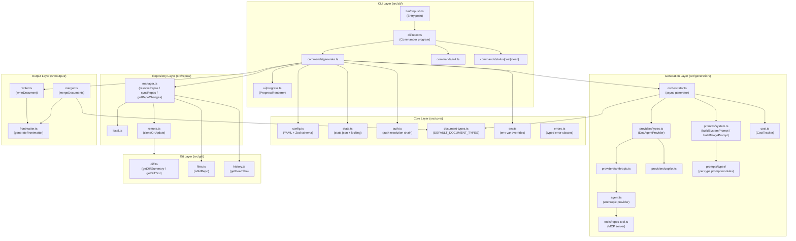
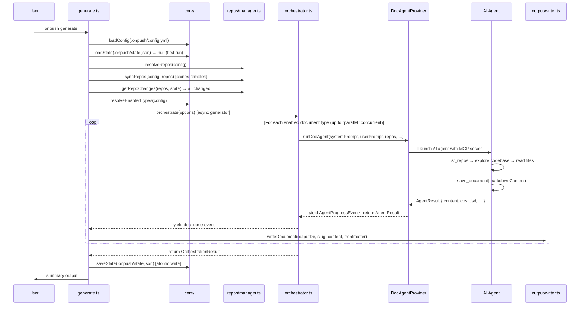
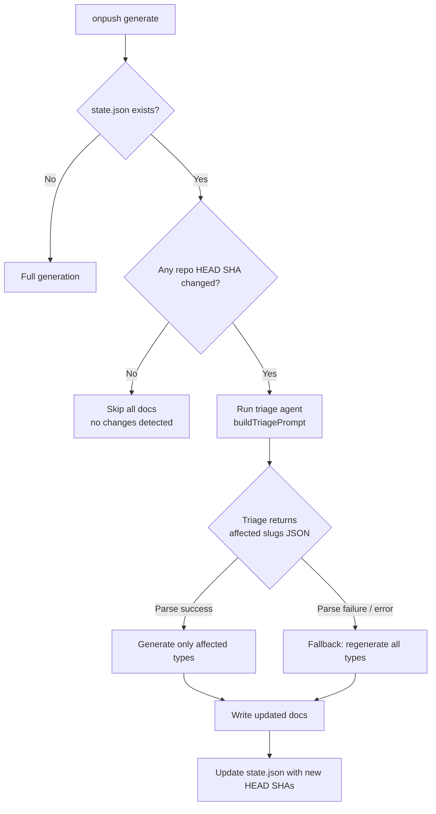
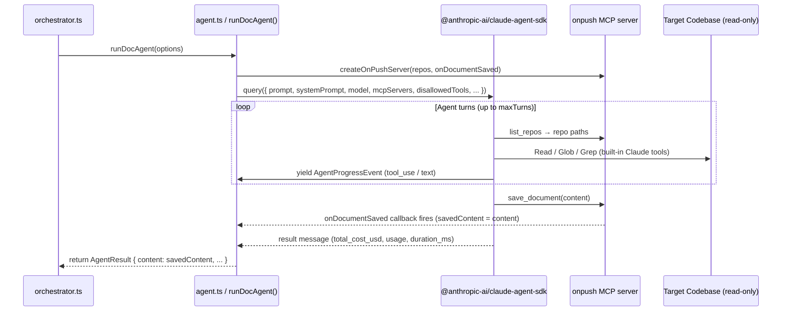

# Architecture / System Design Document

## Table of Contents

- [Architecture Overview](#architecture-overview)
- [Component Diagram](#component-diagram)
- [Core Components](#core-components)
  - [Entry Point & CLI Layer](#entry-point--cli-layer)
  - [Core Module](#core-module)
  - [Generation Pipeline](#generation-pipeline)
  - [Repository Management](#repository-management)
  - [Git Module](#git-module)
  - [Output Module](#output-module)
- [Data Flow](#data-flow)
  - [Full Generation Flow](#full-generation-flow)
  - [Incremental Generation Flow](#incremental-generation-flow)
  - [Agent Execution Flow](#agent-execution-flow)
- [System Design Decisions](#system-design-decisions)
- [External Dependencies](#external-dependencies)
- [Scalability & Performance](#scalability--performance)
- [Directory Structure](#directory-structure)

---

## Architecture Overview

OnPush is a **single-process CLI monolith** written in TypeScript (Node.js ≥ 20, ESM). It orchestrates AI agents to autonomously explore codebases and produce structured Markdown documentation.

The system is organized as a layered architecture:

1. **CLI layer** — parses user commands, manages progress rendering, and wires together the pipeline.
2. **Core layer** — owns configuration, state persistence, authentication, and document-type definitions.
3. **Generation layer** — contains the orchestrator, AI provider abstraction, prompt construction, and cost tracking.
4. **Infrastructure layer** — wraps git operations, repository management (cloning / caching), and file output.

The design philosophy is **one job, done well**: OnPush is a documentation runner, not an AI framework. It delegates all language understanding to pluggable AI providers (Anthropic Claude Agent SDK or GitHub Copilot SDK), while owning the orchestration, incremental diffing, and output lifecycle itself.

The tool is intentionally stateless between invocations except for a single local `state.json` file, making it trivially portable to any CI/CD environment.

---

## Component Diagram



---

## Core Components

### Entry Point & CLI Layer

**`src/bin/onpush.ts`** — The shebang executable. Its sole responsibility is calling `run()` from the CLI index.

**`src/cli/index.ts`** — Constructs the root [`commander`](https://github.com/tj/commander.js) `Command` object, registers global options (`--config`, `--anthropic-api-key`, `--github-token`, `--provider`, `--quiet`, `--no-color`, `--ci`), and registers all sub-commands.

**`src/cli/commands/`** — Each command is a self-contained module exposing a `register*Command(program)` function. The most important is:

- **`generate.ts`** — The main documentation pipeline driver. Implements a 14-step sequence: load config → resolve auth → create provider → load state → resolve repos → sync repos → get repo changes → resolve types → ensure output dir → display header → orchestrate → write files → update state → emit output. It handles all error types and maps them to appropriate exit codes.
- **`init.ts`** — Interactive wizard using `@clack/prompts` to scaffold `.onpush/config.yml`.
- **`types.ts`** — TUI for toggling and creating document types.
- **`status.ts`**, **`cost.ts`**, **`clean.ts`**, **`deinit.ts`** — Informational and maintenance commands.

**`src/cli/ui/progress.ts`** — A `ProgressRenderer` interface with three implementations selected at startup:
- **TTY renderer** — Colored, spinner-based output using `chalk`.
- **CI renderer** — Plain `[onpush]`-prefixed log lines, suitable for CI log capture.
- **Quiet renderer** — Suppresses all output except errors.

The renderer is selected based on `--quiet`, `--ci` / `CI=true`, and `process.stdout.isTTY`. Cost information is hidden automatically when the Copilot provider is in use (since Copilot does not expose token/cost data).

---

### Core Module

**`src/core/config.ts`** — Defines the full configuration schema using [Zod](https://github.com/colinhacks/zod) and manages YAML serialization. Key design choices:

- A discriminated union on `mode: "current" | "remote"` enforces that single-repo configs have `repository?: { path }` while multi-repo configs require a `repositories` array.
- Zod `.safeParse()` is used so validation errors are collected and presented as human-readable messages rather than thrown exceptions.
- The `filename_template` field is validated to prevent path traversal via `..` or absolute paths.

**`src/core/state.ts`** — Manages `.onpush/state.json`. Stores the last generation timestamp, model, cost, per-document version counters and costs, per-repository HEAD SHAs, and a rolling history of up to 100 entries.

Writes are done **atomically**: content is written to a `.tmp` file then renamed, preventing partial writes from corrupting the state file. Concurrent access is protected by a **`mkdir`-based advisory lock** (`.onpush/state.json.lock`), which is atomic on all POSIX and Windows filesystems. Stale locks older than 30 seconds are removed automatically.

**`src/core/auth.ts`** — Implements the authentication resolution chains:
- **Anthropic**: flag → `ANTHROPIC_API_KEY` env var → implicit Claude Code session (the SDK handles this when no key is supplied).
- **Copilot**: flag → `COPILOT_GITHUB_TOKEN` / `GH_TOKEN` / `GITHUB_TOKEN` env vars → GitHub CLI stored credentials.

**`src/core/document-types.ts`** — Defines the nine built-in `DEFAULT_DOCUMENT_TYPES` (slugs, names, descriptions, default-enabled status) and the `resolveEnabledTypes(config)` function that merges config overrides and custom types into a flat `DocumentType[]`.

**`src/core/env.ts`** — Reads `ONPUSH_*` environment variables to produce `EnvOverrides`. This sits at the middle tier of the override precedence: `CLI flags > env vars > config file`.

**`src/core/errors.ts`** — Defines typed error classes (`ConfigError`, `AuthError`, `GenerationError`, `CancelError`, `CostLimitError`) and the `ExitCode` enum (0 = success, 1 = fatal, 2 = partial failure, 3 = cost limit exceeded).

---

### Generation Pipeline

**`src/generation/orchestrator.ts`** — The central coordination engine. Implemented as an **`async function*` generator** that yields `OrchestrationEvent` values for real-time UI updates and returns an `OrchestrationResult` when complete.

Key orchestration behaviors:

| Scenario | Behavior |
|---|---|
| First run / `--full` | All document types are generated |
| Subsequent run, no repo changes | All types skipped immediately |
| Subsequent run, changes detected | Triage agent runs; only affected types are regenerated |
| `--type <slug>` flag | Only that single type is generated |
| Parallel mode (`parallel > 1`) | Types are launched concurrently up to the configured limit using a manual queue + `Promise.race` loop |
| Sequential mode | Types are generated one at a time |
| Cost limit exceeded | `AbortController.abort()` is called; in-flight agents are awaited and remaining queued items are marked skipped |

Each document generation has **one automatic retry** with a 2-second backoff before being marked as failed.

**`src/generation/agent.ts`** — The Anthropic provider's agent runner. Uses `query()` from `@anthropic-ai/claude-agent-sdk` with:
- `permissionMode: "bypassPermissions"` — The agent may read files freely but write/edit tools are explicitly disallowed.
- `disallowedTools: ["Write", "Edit", "MultiEdit", "NotebookEdit", "Agent", "TodoWrite"]` — Prevents the agent from modifying the target codebase.
- A custom `onpush` MCP server injected via `mcpServers` (see `repos-tool.ts`).
- `persistSession: false` — Sessions are stateless per document.

**`src/generation/providers/types.ts`** — The `DocAgentProvider` interface:
```typescript
interface DocAgentProvider {
  readonly name: ProviderName;
  runDocAgent(options: AgentOptions): AsyncGenerator<AgentProgressEvent, AgentResult>;
  initialize?(): Promise<void>;
  shutdown?(): Promise<void>;
}
```
The `initialize`/`shutdown` lifecycle hooks allow the Copilot provider to manage a single shared `CopilotClient` across all concurrent sessions.

**`src/generation/providers/anthropic.ts`** — Thin wrapper delegating directly to `runDocAgent()` from `agent.ts`.

**`src/generation/providers/copilot.ts`** — Full implementation using `@github/copilot-sdk`. Since the Copilot SDK does not expose an MCP-style tool registry, the `save_document` and `list_repos` tools are registered directly as session tools. Crucially, the Copilot SDK does not return token usage or cost data; those fields are always `0`.

**`src/generation/providers/index.ts`** — Factory function `createProvider(name)` using dynamic `import()` for the Copilot provider. This keeps `@github/copilot-sdk` as an optional dependency — if it is not installed, the `ERR_MODULE_NOT_FOUND` error is caught and re-thrown with a user-friendly install instruction.

**`src/generation/tools/repos-tool.ts`** — Creates an in-process MCP server (via `createSdkMcpServer` from the Claude Agent SDK) exposing two tools:
- **`list_repos`** — Returns JSON of all `{ name, path, type }` entries. The agent calls this first to understand the repository context.
- **`save_document`** — Receives the final Markdown content. The callback captures it via closure into `savedContent`, which is then returned as the agent's output. This is the canonical mechanism for extracting clean document content without conversational noise.

**`src/generation/prompts/system.ts`** — Builds the complete system prompt for each agent invocation. The prompt is assembled from sections: role, approach, repository context, output requirements, per-type instructions, optional user-provided additional instructions, and (for incremental runs) the existing document content with change context. A separate `buildTriagePrompt()` constructs the prompt for the triage agent.

**`src/generation/prompts/types/`** — One module per built-in document type, each exporting `getPrompt(): string`. These contain the detailed, structured guidance (sections to cover, audience, guidance notes) that drives documentation quality.

**`src/generation/cost.ts`** — `CostTracker` class: accumulates `DocumentCost` entries (slug, USD cost, token counts, duration), provides `getTotalCost()`, `isOverLimit(limit)`, and `getSummary()`.

---

### Repository Management

**`src/repos/manager.ts`** — Top-level facade with three functions:
- `resolveRepos(config, configPath)` — Builds a `ResolvedRepo[]` from config, resolving paths relative to the config directory.
- `syncRepos(config, repos, configPath)` — Clones or updates remote repos into `.onpush/cache/` (no-op for `current` mode).
- `getRepoChanges(repos, state)` — Compares each repo's current HEAD SHA to the SHA stored in state to produce a `RepoChangeSet[]`.

**`src/repos/remote.ts`** — Handles cloning and updating remote repositories:
- `resolveGitUrl()` validates URLs against an allowlist of safe protocols (`https://`, `http://`, `ssh://`, `git@`), explicitly rejecting dangerous protocols like `ext::`.
- `sanitizeDirName()` converts a URL to a safe filesystem directory name for the cache.
- `cloneOrUpdate()` performs a shallow clone on first access; subsequent runs fetch and pull. If the clone is shallow, `--unshallow` is used before fetching to ensure full history is available for incremental diff computation.

**`src/repos/local.ts`** — Resolves local path-based repository entries, validating they are git repositories.

---

### Git Module

**`src/git/diff.ts`** — Wraps `simple-git` to provide `getDiffSummary()` (file-level statistics between two SHAs) and `getDiffText()` (raw unified diff text).

**`src/git/files.ts`** — Provides `isGitRepo(path)` to check if a directory is a git repository.

**`src/git/history.ts`** — Provides `getHeadSha(repoPath)` to retrieve the current HEAD commit SHA.

---

### Output Module

**`src/output/writer.ts`** — `writeDocument()` prepends YAML frontmatter to the agent-generated content, then writes it to `{outputDir}/{filename_template}`. Includes a path traversal check: the resolved output path must start with the output directory.

**`src/output/frontmatter.ts`** — Generates and parses YAML frontmatter blocks containing `title`, `generated_by: onpush`, `generated_at` (ISO 8601), `version`, and `model`.

**`src/output/merger.ts`** — `mergeDocuments()` concatenates all documents into a single `complete-documentation.md`. Documents are ordered by `DOCUMENT_TYPE_ORDER` (canonical slug order); custom types are appended alphabetically. HTML `<a id>` anchors are inserted for in-page navigation.

---

## Data Flow

### Full Generation Flow



### Incremental Generation Flow



The triage agent is a lightweight, low-`maxTurns` agent run. It receives the git diffs between the last-recorded SHAs and the current HEAD for each changed repository, then returns a JSON array of document slugs that need updating. The triage agent is billed against the same cost tracker as the main generation.

### Agent Execution Flow



---

## System Design Decisions

### 1. Async Generator Pattern for Orchestration

**Decision**: The `orchestrate()` function is an `async function*` generator that yields `OrchestrationEvent` values and returns `OrchestrationResult`.

**Rationale**: Documentation generation can take minutes. The generator pattern decouples event emission from event consumption, allowing the CLI layer to update the UI in real time without the orchestrator needing any knowledge of how progress is displayed. It also makes testing straightforward — tests can collect all events into an array.

**Trade-off**: The generator must be consumed correctly (always awaited to completion) to avoid resource leaks. The `generate.ts` command does this with a `while (!event.done)` loop.

### 2. MCP Server for Document Capture

**Decision**: Document content is captured by injecting a custom `save_document` MCP tool into the agent session rather than parsing the agent's final text output.

**Rationale**: AI agents often include conversational preamble, commentary, or markdown fences around the document content. The `save_document` tool acts as an explicit, structured API contract — the agent is instructed that only content passed to this tool is saved, so there is no ambiguity about what constitutes the final document. This approach is cleaner than regex extraction and aligns with how the Claude Agent SDK is designed to be used.

**Trade-off**: The Copilot SDK does not natively support MCP servers, requiring a separate implementation that registers the tools as regular session tools instead.

### 3. Provider Abstraction via `DocAgentProvider` Interface

**Decision**: Both AI providers implement a single `DocAgentProvider` interface with `runDocAgent()`, `initialize()`, and `shutdown()`.

**Rationale**: This allows the rest of the system to be provider-agnostic. New AI providers can be added by implementing one interface and registering in `createProvider()`. The Copilot SDK is loaded dynamically (`import()`) so it remains optional, keeping the package installable for Anthropic-only users without needing the Copilot SDK.

**Trade-off**: The Copilot provider lacks token/cost reporting because the Copilot SDK does not expose this data. Cost fields are hardcoded to `0` for Copilot sessions, and cost-related UI is suppressed automatically.

### 4. Incremental Generation with a Triage Agent

**Decision**: Rather than regenerating all documents on every run, a lightweight triage agent reads git diffs and returns a JSON list of affected document slugs.

**Rationale**: Full regeneration of all document types on a large codebase can take many minutes and incur significant AI API costs. The triage step is fast (capped at 20 turns) and dramatically reduces unnecessary work for CI pipelines that run on every push.

**Trade-off**: The triage agent itself consumes tokens and incurs cost. If triage fails or cannot parse valid JSON, the system falls back to regenerating all types — the safe default. This "fail open to full regeneration" strategy ensures documentation is never silently stale.

### 5. Filesystem-Based State with `mkdir` Locking

**Decision**: State is persisted in `.onpush/state.json` using atomic rename writes and an advisory `mkdir`-based lock.

**Rationale**: A local file is the simplest possible persistence mechanism — no database or server required. `mkdir` is atomic on all POSIX filesystems and on Windows (unlike `open(O_CREAT | O_EXCL)`), making it a portable cross-platform lock. Atomic rename ensures readers never see a partially written file.

**Trade-off**: This is a single-host solution — parallel `onpush` processes on different machines (e.g., concurrent CI runners) that share a filesystem would need external coordination. In practice, CI pipelines run sequentially or in separate working directories.

### 6. Configuration Schema with Discriminated Union

**Decision**: The config uses a `z.discriminatedUnion("mode", [SingleRepoConfigSchema, MultiRepoConfigSchema])` to enforce mutually exclusive shapes.

**Rationale**: Single-repo and multi-repo configs have fundamentally different required fields. A discriminated union provides precise TypeScript types and clear validation error messages, avoiding the need for manual conditional validation logic throughout the codebase.

### 7. Override Precedence: CLI Flags > Env Vars > Config File

**Decision**: Settings can be specified at three levels with explicit precedence: CLI flags override environment variables, which override config file values.

**Rationale**: This is the standard pattern for CLI tools and is essential for CI/CD integration — secrets and one-off overrides belong in the environment, while project defaults belong in the committed config file.

---

## External Dependencies

| Package | Purpose | Notes |
|---|---|---|
| `@anthropic-ai/claude-agent-sdk` | Launches Claude agents with tool use (Anthropic provider) | Core dependency; provides `query()`, `tool()`, `createSdkMcpServer()` |
| `@github/copilot-sdk` | Launches Copilot agents (Copilot provider) | **Optional** dependency; loaded dynamically |
| `commander` | CLI argument parsing and command registration | Industry-standard, stable API |
| `@clack/prompts` | Interactive terminal prompts for `init` and `types` commands | Clean TUI without heavy dependencies |
| `chalk` | Terminal color output | ESM-only v5; used exclusively in the TTY renderer |
| `simple-git` | Git operations (diff, fetch, clone, pull) | Wraps the local `git` binary |
| `yaml` | YAML parsing/serialization for config files and frontmatter | Used in `config.ts` and `frontmatter.ts` |
| `zod` | Runtime schema validation for config and state | v4; provides discriminated unions and `.safeParse()` |
| `minimatch` | Glob pattern matching for exclude patterns | Used in file filtering |

**Why Anthropic Claude Agent SDK?** The SDK provides autonomous agent execution with built-in tools (Bash, Read, Glob, Grep, WebFetch, etc.) that allow the agent to explore any codebase without OnPush needing to implement file reading or search capabilities itself. The MCP server protocol enables clean injection of custom tools (`save_document`, `list_repos`).

**Why `simple-git`?** It provides a typed, async wrapper around the local `git` binary. This means OnPush requires no native bindings and works anywhere `git` is installed — which is essentially every developer machine and CI environment.

**Why `zod` for config validation?** Zod provides TypeScript-first schema definitions that generate both runtime validation and compile-time types from a single source of truth. The discriminated union support is essential for the single/multi-repo config shape difference.

---

## Scalability & Performance

### Parallel Document Generation

Documents are generated concurrently up to the `parallel` limit (default: 10, configurable). The orchestrator uses a manual queue + `Promise.race` loop rather than `Promise.all`, which allows:

- The UI to receive real-time updates as each document completes.
- Cost limit checks between each completion, so new work is not started once the limit is exceeded.
- In-flight tasks to complete naturally when the cost limit is hit, rather than being killed mid-generation.

### Cost Control

The `CostTracker` checks `isOverLimit()` after every document completion. When exceeded:
1. `costAbortController.abort()` is called, cancelling all in-flight agent sessions (the Claude Agent SDK propagates the abort signal).
2. Remaining queued documents are marked as `skipped`.
3. The CLI exits with code `3`.

An individual document's budget can also be constrained via `maxBudgetUsd` in the agent options, calculated as `(costLimit * 0.9) / remainingDocs` — a proportional slice of the remaining budget.

### Incremental Updates

The incremental triage system is the primary scaling mechanism for CI use. On a codebase with 9 document types:
- A code change touching only API endpoints may require regenerating only `api-reference` and `architecture`.
- Test-only changes may require regenerating only `testing`.
- The triage agent typically completes in a few seconds, saving the cost and time of 7–8 full document generations.

### Remote Repository Caching

Remote repositories are cached in `.onpush/cache/` as named directories derived from the sanitized URL. Subsequent runs perform `git fetch` + `git pull` rather than a full clone, which is significantly faster for large repositories. Shallow clones are automatically unshallowed when incremental diffs are needed.

### No In-Memory Document Caching

Generated document content is not cached in memory across runs — each run reads any existing document from disk (for incremental updates) and writes the new version to disk. This keeps peak memory usage proportional to a single document's content rather than all documents combined.

---

## Directory Structure

```
onpush-cli/
├── src/
│   ├── bin/
│   │   └── onpush.ts           # Executable entry point (shebang)
│   │
│   ├── cli/
│   │   ├── index.ts            # Commander program setup + command registration
│   │   ├── commands/
│   │   │   ├── generate.ts     # Main pipeline driver (14-step sequence)
│   │   │   ├── init.ts         # Interactive config wizard
│   │   │   ├── types.ts        # Document type TUI manager
│   │   │   ├── status.ts       # Show generation state
│   │   │   ├── cost.ts         # Show cost history
│   │   │   ├── clean.ts        # Remove generated docs
│   │   │   ├── deinit.ts       # Remove onpush configuration
│   │   │   └── json-output.ts  # JSON output formatter (--json / CI mode)
│   │   └── ui/
│   │       ├── progress.ts     # ProgressRenderer (TTY / CI / quiet)
│   │       └── prompts.ts      # @clack/prompts wrappers
│   │
│   ├── core/
│   │   ├── config.ts           # YAML config schema (Zod) + load/save
│   │   ├── state.ts            # state.json management (atomic write + lock)
│   │   ├── auth.ts             # Auth resolution chains (Anthropic + Copilot)
│   │   ├── document-types.ts   # DEFAULT_DOCUMENT_TYPES + resolveEnabledTypes
│   │   ├── env.ts              # ONPUSH_* environment variable overrides
│   │   └── errors.ts           # Typed error classes + ExitCode enum
│   │
│   ├── generation/
│   │   ├── orchestrator.ts     # Async generator pipeline (full + incremental)
│   │   ├── agent.ts            # Anthropic agent runner (Claude Agent SDK)
│   │   ├── cost.ts             # CostTracker
│   │   ├── providers/
│   │   │   ├── types.ts        # DocAgentProvider interface + DEFAULT_MODELS
│   │   │   ├── index.ts        # createProvider() factory (dynamic import)
│   │   │   ├── anthropic.ts    # AnthropicProvider (delegates to agent.ts)
│   │   │   └── copilot.ts      # CopilotProvider (Copilot SDK integration)
│   │   ├── prompts/
│   │   │   ├── system.ts       # buildSystemPrompt() + buildTriagePrompt()
│   │   │   └── types/          # Per-type prompt modules (one per doc type)
│   │   │       ├── architecture.ts
│   │   │       ├── api-reference.ts
│   │   │       ├── product-overview.ts
│   │   │       └── ... (6 more)
│   │   └── tools/
│   │       └── repos-tool.ts   # onpush MCP server (list_repos + save_document)
│   │
│   ├── git/
│   │   ├── diff.ts             # getDiffSummary() + getDiffText()
│   │   ├── files.ts            # isGitRepo()
│   │   └── history.ts          # getHeadSha()
│   │
│   ├── output/
│   │   ├── writer.ts           # writeDocument() with path-traversal guard
│   │   ├── frontmatter.ts      # YAML frontmatter generate + parse
│   │   └── merger.ts           # mergeDocuments() for --single-file
│   │
│   ├── repos/
│   │   ├── manager.ts          # resolveRepos / syncRepos / getRepoChanges
│   │   ├── local.ts            # Local path repo resolution
│   │   └── remote.ts           # cloneOrUpdate() with URL validation
│   │
│   └── types/
│       └── copilot-sdk.d.ts    # Type declarations for @github/copilot-sdk
│
├── scripts/
│   └── postinstall.mjs         # Post-install script
├── docs/                       # (generated output, not committed)
├── .onpush/
│   ├── config.yml              # OnPush config for this project
│   └── state.json              # Generation state (gitignored)
├── package.json
├── tsconfig.json               # ES2022, Node16 modules, strict
└── vitest.config.ts            # Test configuration
```

Each top-level `src/` subdirectory maps directly to one architectural layer, keeping concerns cleanly separated. Tests are co-located under `__tests__/` within each module directory and are excluded from the TypeScript compilation output.

