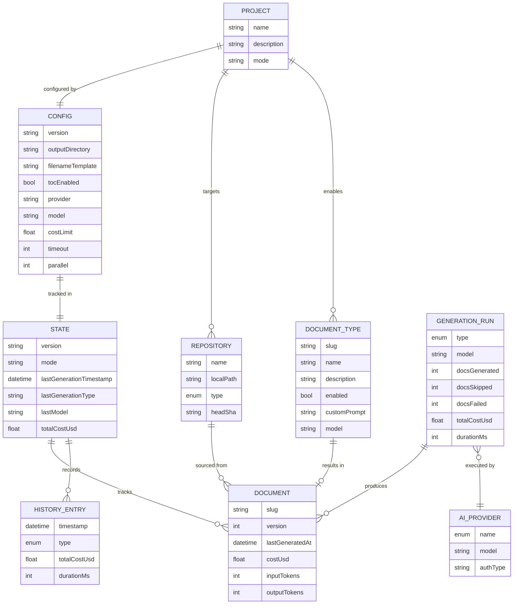
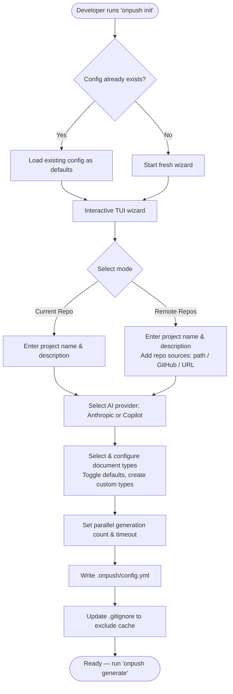
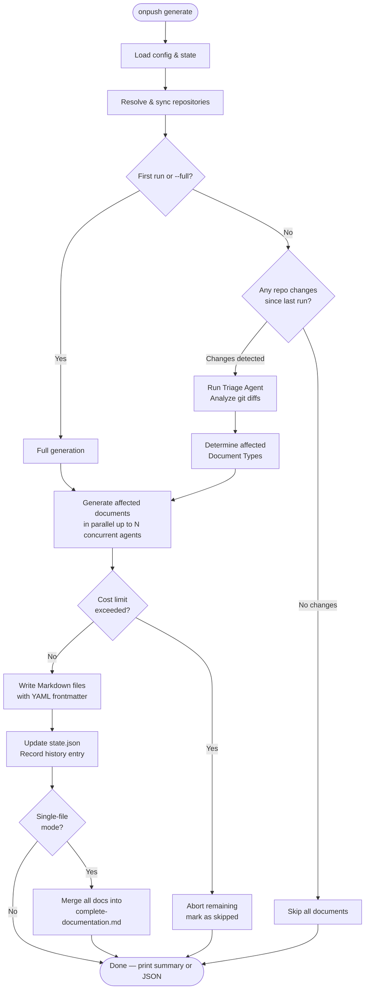
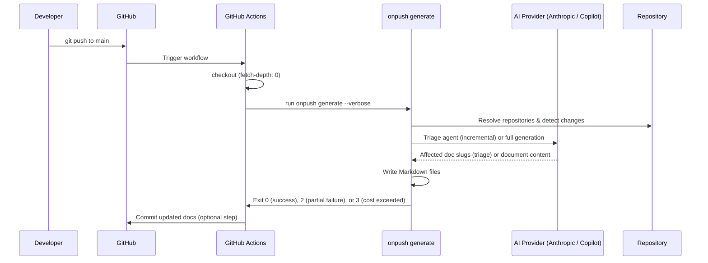

# Business Overview

## Table of Contents

- [Business Context](#business-context)
- [Domain Model](#domain-model)
- [Key Workflows](#key-workflows)
  - [Project Initialization](#project-initialization)
  - [Documentation Generation](#documentation-generation)
  - [Incremental Updates](#incremental-updates)
  - [CI/CD Pipeline Integration](#cicd-pipeline-integration)
- [Stakeholder Value](#stakeholder-value)
- [Business Rules](#business-rules)
- [Integrations](#integrations)
- [Revenue & Growth Model](#revenue--growth-model)

---

## Business Context

Software documentation is one of the most consistently neglected disciplines in software development. Teams ship new features, rename modules, and retire APIs — but documentation rarely keeps pace. The result is stale READMEs, missing architecture diagrams, and tribal knowledge locked inside developers' heads.

**OnPush CLI** addresses this problem directly: it is an AI-powered documentation generator that autonomously explores a codebase and produces or updates comprehensive Markdown documents. Rather than asking developers to write documentation manually, OnPush deploys AI agents (powered by Anthropic Claude or GitHub Copilot) to read source files, search for patterns, inspect git history, and generate accurate technical documents — then keeps those documents fresh by regenerating only the sections affected by each code change.

OnPush targets two primary use patterns:

1. **Individual developer / team use** — Run `onpush generate` locally against a project already in progress to bootstrap a full documentation suite in minutes.
2. **CI/CD automation** — Integrate OnPush into a GitHub Actions (or equivalent) pipeline so that documentation updates automatically whenever code is pushed to the main branch.

The tool is distributed as an npm package (`onpush-cli`) and licensed under the [Elastic License 2.0](../LICENSE), making it freely usable for internal and non-competing commercial purposes while protecting the commercial interests of the maintainers.

---

## Domain Model

### Key Domain Terms

| Term | Definition |
|------|------------|
| **Project** | A named software codebase being documented. Configured via `.onpush/config.yml`. |
| **Repository** | A git repository that OnPush reads as source material. Can be the current repo, a local sibling path, a GitHub shorthand (`org/repo`), or any Git URL. |
| **Document Type** | A category of documentation (e.g. *Architecture*, *API Reference*, *Business Overview*). OnPush ships nine built-in types; users can define unlimited custom types. |
| **Document** | The Markdown file produced for a single Document Type. Stored in the configured output directory with YAML frontmatter (title, model, version, generation timestamp). |
| **Generation Run** | A single execution of `onpush generate`. Can be *full* (all enabled types regenerated) or *incremental* (only types affected by git changes). |
| **Triage Agent** | A lightweight AI agent that runs before an incremental generation. It reads git diffs and decides which Document Types need updating, reducing unnecessary AI calls and cost. |
| **State** | A JSON file (`.onpush/state.json`) that records the last-known git commit SHA for each repository, per-document metadata, and a 100-entry generation history. Used to enable incremental updates. |
| **Provider** | The AI platform supplying the agent: **Anthropic** (Claude) or **GitHub Copilot**. |
| **BYOK** | Bring Your Own Key — an option for Copilot users to route agent calls through their own OpenAI-compatible, Azure OpenAI, or Anthropic endpoint. |
| **Cost Limit** | A configurable USD ceiling that aborts generation once cumulative AI spend exceeds the threshold. Applies only to the Anthropic provider (Copilot is billed through GitHub subscriptions). |
| **Slug** | A URL-safe identifier for a Document Type, e.g. `api-reference`, `business-overview`. Used as the output filename and as the key in config/state files. |

---

## Key Workflows

### Project Initialization

**Key outcomes:**
- `.onpush/config.yml` created with validated YAML configuration.
- `.gitignore` updated to exclude `.onpush/cache/` (cloned remote repos).
- Custom document types assembled into structured AI prompts matching built-in type quality.

---

### Documentation Generation

**Generation pipeline steps in detail:**

| Step | Description |
|------|-------------|
| **1. Config & state load** | Validates `.onpush/config.yml` (Zod schema) and reads `.onpush/state.json`. |
| **2. Repository sync** | Remote repos are shallow-cloned or fetched into `.onpush/cache/`. Local repos are validated as git repositories. |
| **3. Change detection** | HEAD SHAs compared against last-recorded SHAs in state to identify changed repos. |
| **4. Triage** | (Incremental only) A fast AI agent reads diffs and returns a JSON array of slugs that need regeneration. Falls back to full regeneration on parse failure. |
| **5. Agent execution** | One AI agent per Document Type. Each agent explores the codebase freely (read, search, git tools) and calls `save_document` to submit its Markdown output. |
| **6. Retry** | Each document gets one automatic retry with 2-second backoff on failure. |
| **7. Output writing** | Markdown files written to the configured output directory with auto-generated YAML frontmatter. |
| **8. State persistence** | State updated atomically (write-rename with advisory lock) to track the new HEAD SHAs, per-document metadata, and history. |

---

### Incremental Updates

Incremental updates are the core value proposition for teams using OnPush in CI. Rather than regenerating every document on every push:

1. **Commit SHA tracking** — OnPush records the HEAD SHA for each repository at the time of generation.
2. **Change detection** — On subsequent runs, if SHA hasn't changed, the entire run is skipped instantly.
3. **Triage agent** — If changes exist, a lightweight agent inspects the diffs and returns only the slugs whose documentation is likely to be stale (e.g., an API endpoint added → `api-reference` needs updating; a CSS tweak → `architecture` can be skipped).
4. **Surgical update** — Each affected document agent receives the existing document content and is instructed to update *only* the sections that changed, preserving everything else.

This reduces both AI costs and generation time dramatically for large documentation suites.

---

### CI/CD Pipeline Integration

- CI mode is auto-detected via the `CI=true` environment variable.
- In CI mode, all output switches to structured JSON suitable for log parsing.
- The `--json` flag can also force JSON output outside CI.
- Interactive commands (`init`, `types`, `deinit`) refuse to run in CI mode.

---

## Stakeholder Value

### Individual Developers

- **Zero-effort documentation bootstrap** — Run `onpush generate` once on a mature codebase and receive a full documentation suite in minutes rather than days.
- **Stay in flow** — No need to context-switch into writing prose; the AI reads code and generates accurate, structured documentation.
- **Flexible AI access** — Use an existing Claude Code or GitHub Copilot subscription with no additional API keys required for local use.

### Engineering Teams

- **Living documentation** — Incremental updates in CI mean docs stay synchronized with code without any manual intervention.
- **Multi-repo support** — Teams with microservice architectures can document all services from a single, centralised docs repository.
- **Custom document types** — Teams can define domain-specific document types (e.g. "Runbook", "Onboarding Guide") with full control over structure and guidance.
- **Parallel generation** — Up to 10 (configurable) AI agents run concurrently, keeping generation time proportional to the longest single document rather than the total count.

### Engineering Managers & Tech Leads

- **Onboarding acceleration** — A consistent documentation suite (architecture, API reference, business overview) dramatically reduces the time new engineers take to become productive.
- **Audit trail** — Per-document version numbers, generation timestamps, and a 100-entry history log provide visibility into how documentation has evolved alongside the codebase.
- **Cost control** — Configurable USD cost limits (`cost_limit` in config or `--cost-limit` flag) prevent runaway AI spending.

### DevOps / Platform Teams

- **CI-native design** — Structured JSON output, machine-readable exit codes, and environment variable–driven configuration make OnPush easy to integrate into any pipeline.
- **Security-conscious defaults** — Sensitive files (`.env*`, `*.key`, `*.pem`, `credentials*`) are excluded from agent access by default.
- **Bring Your Own Key (BYOK)** — Copilot users can route generation through their own managed LLM endpoints (OpenAI, Azure OpenAI, Anthropic), supporting air-gapped or compliance-restricted environments.

---

## Business Rules

### Configuration Constraints

- A project must specify exactly one operating mode: `current` (single repo) or `remote` (one or more external repos).
- Each repository entry must specify exactly one of: `path`, `url`, or `github`. Specifying multiple is a validation error.
- The `filename_template` must not contain `..` or start with `/` to prevent path traversal at configuration time.
- Document type slugs must match `^[a-z0-9]+(?:-[a-z0-9]+)*$` (lowercase alphanumeric and hyphens only).
- Remote mode requires at least one repository entry.

### Generation Rules

- **First run is always full.** Incremental mode requires an existing `state.json`; without it, all enabled types are generated unconditionally.
- **Cost limit is enforced cumulatively.** Once total spend across all documents in a run exceeds `cost_limit`, remaining queued documents are marked `skipped` and the run exits with code `3`.
- **Each document gets one retry.** On failure, the agent waits 2 seconds and retries once. A second failure marks the document as `failed` and sets exit code `2` (partial failure) unless a harder error has already set code `1` or `3`.
- **Triage fallback to full.** If the triage agent returns an unparseable response or itself fails, OnPush regenerates all enabled types rather than silently skipping any.
- **Output directory is excluded from agent reads.** The generated docs directory is appended to the `exclude` patterns at runtime so agents don't accidentally read their own prior output as source material.
- **State writes are atomic.** State is written to a `.tmp` file and renamed, with a mutex lock, to prevent corruption during parallel generation.
- **History is capped at 100 entries.** Oldest entries are dropped automatically to bound state file growth.

### Security Rules

- Agents are granted `bypassPermissions` / `allowDangerouslySkipPermissions` for read operations only. Write tools (`Write`, `Edit`, `MultiEdit`, `NotebookEdit`) and the `Agent` orchestration tool are explicitly disallowed.
- Path traversal in output filenames is detected and rejected at write time.
- Stale state locks (older than 30 seconds) are automatically cleared to recover from crashed processes.

### Authentication Rules

- Anthropic auth resolves in priority order: CLI flag → `ANTHROPIC_API_KEY` env var → active Claude Code session.
- Copilot auth resolves in priority order: CLI flag → `COPILOT_GITHUB_TOKEN` → `GH_TOKEN` → `GITHUB_TOKEN` → GitHub CLI credentials.
- BYOK options (`--byok-*`) are only valid when `--provider copilot` is active; using them with the Anthropic provider is a fatal configuration error.

---

## Integrations

### Anthropic Claude (Primary AI Provider)

- **SDK**: `@anthropic-ai/claude-agent-sdk`
- **Integration type**: Programmatic agent execution via the `query()` function.
- **Model default**: `claude-sonnet-4-6`
- **Auth**: API key or active Claude Code session.
- **Cost visibility**: Full USD cost, input token, and output token counts are surfaced per document and in the run summary.
- **Business relevance**: The default and recommended provider for precise, high-quality documentation output.

### GitHub Copilot (Alternative AI Provider)

- **SDK**: `@github/copilot-sdk` (optional peer dependency)
- **Integration type**: Session-based agent using `CopilotClient` and `CopilotSession`.
- **Model default**: `gpt-4.1`
- **Auth**: GitHub token (personal access token, `GH_TOKEN`, or GitHub CLI credentials).
- **Cost visibility**: None — Copilot usage is billed through the user's GitHub subscription. Cost is always reported as `$0.00`.
- **BYOK support**: Copilot sessions can be redirected to a custom LLM endpoint (`type: openai | azure | anthropic`), allowing integration with enterprise AI deployments.
- **Business relevance**: Enables organisations already paying for GitHub Copilot to generate documentation at no incremental API cost.

### Git (Source Control Backbone)

- **Library**: `simple-git`
- **Usage**: Cloning remote repositories, fetching updates, reading commit SHAs, and computing diffs for incremental triage.
- **Business relevance**: The git history is the source of truth for change detection; without it, incremental updates cannot function.

### GitHub Actions (CI/CD)

- **Integration type**: Shell-level — OnPush is invoked as a CLI step.
- **CI detection**: Automatic via `CI=true` environment variable.
- **Output**: Structured JSON to stdout when in CI mode, suitable for downstream step parsing.
- **Business relevance**: Enables teams to maintain always-current documentation as part of their existing deployment pipeline with minimal configuration.

### npm Registry

- **Role**: Distribution channel for the `onpush-cli` package.
- **Business relevance**: Provides frictionless installation (`npm install -g onpush-cli`) and version management for end users.

---

## Revenue & Growth Model

OnPush CLI is licensed under the **Elastic License 2.0 (ELv2)**, a source-available license that permits free use for internal and personal purposes but restricts offering the software as a managed service or SaaS product without a commercial agreement. This positions OnPush in the "open core" commercial model:

| Dimension | Details |
|-----------|---------|
| **Free tier** | Full CLI functionality for individuals and teams using their own AI subscriptions (Anthropic or Copilot). |
| **Source availability** | Source code is publicly viewable on GitHub, encouraging community contributions and trust-building while preserving commercial rights. |
| **AI cost pass-through** | OnPush does not mark up AI costs. Users pay their AI provider (Anthropic or GitHub) directly. This removes a billing friction point and accelerates adoption. |
| **BYOK as enterprise enabler** | The BYOK option for Copilot lets enterprise customers route generation through their own AI infrastructure, addressing security and compliance requirements that would otherwise block adoption in regulated industries. |
| **Growth levers** | Word-of-mouth via generated documentation quality; CI/CD integration stickiness (teams that automate docs rarely revert); the `onpush` brand embedded in generated document frontmatter (`model`, `generatedAt` fields). |
| **Contribution model** | Community contributions are welcomed via pull requests against the `next` branch. Feature additions require maintainer approval, giving the core team control over product direction while benefiting from community effort. |

The cost tracking infrastructure built into OnPush (per-document USD cost, historical run log, cost-limit enforcement) also lays the groundwork for potential future hosted/SaaS offerings where usage-based billing would be a natural extension.

