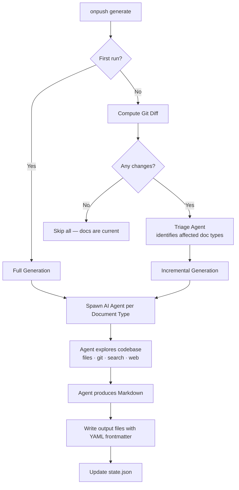

# Product Overview

## Table of Contents

- [Purpose](#purpose)
- [Key Features](#key-features)
  - [AI-Powered Documentation Generation](#ai-powered-documentation-generation)
  - [Incremental Updates](#incremental-updates)
  - [Multi-Repository Support](#multi-repository-support)
  - [Flexible Document Types](#flexible-document-types)
  - [CI/CD Integration](#cicd-integration)
  - [Cost Management](#cost-management)
- [Target Audience](#target-audience)
- [How It Works](#how-it-works)
- [Technology Stack](#technology-stack)
- [Project Structure](#project-structure)

---

## Purpose

Software documentation is notoriously difficult to keep current. As codebases evolve, documentation quickly becomes stale — teams either neglect it entirely or spend significant time manually rewriting it after every meaningful change.

**OnPush** solves this by automating the full documentation lifecycle. It uses AI agents (powered by Anthropic Claude or GitHub Copilot) to autonomously explore a codebase — reading source files, inspecting git history, and searching code — then produces and maintains a comprehensive set of Markdown documents.

The core value proposition is twofold:
1. **Initial generation**: Go from zero documentation to a complete, structured doc set in a single command.
2. **Continuous maintenance**: On subsequent runs, OnPush detects what changed in git, identifies only the affected documents, and regenerates just those — keeping docs in sync without manual effort.

OnPush is designed for both local developer workflows and automated CI/CD pipelines. It can document the repository it lives in, or act as a centralized documentation hub targeting multiple external repositories.

---

## Key Features

### AI-Powered Documentation Generation

OnPush supports two AI providers:

| Provider | Auth Methods |
|----------|-------------|
| **Anthropic** (default) | API key, `ANTHROPIC_API_KEY` env var, or existing Claude Code session |
| **GitHub Copilot** | GitHub token flag, `COPILOT_GITHUB_TOKEN` / `GH_TOKEN` / `GITHUB_TOKEN` env vars, or GitHub CLI credentials |

The Copilot provider also supports **Bring Your Own Key (BYOK)**, allowing teams to route generation through their own OpenAI, Azure OpenAI, or Anthropic API endpoints.

Documents are generated by autonomous AI agents that are given tools for reading files, searching code, inspecting git history, and fetching web resources — the same capabilities a human engineer would use to understand an unfamiliar codebase.

### Incremental Updates

After the initial full generation, subsequent runs are **incremental**:

1. OnPush computes a git diff of each tracked repository since the last generation.
2. A lightweight **triage agent** analyzes the diff and identifies which document types are affected by the changes.
3. Only the affected documents are regenerated; everything else is skipped.

This keeps documentation costs low and generation times fast for active repositories with frequent small changes.

### Multi-Repository Support

OnPush operates in two modes:

- **Current Repo** — Documents the repository it is configured in. Output files sit alongside the source code.
- **Remote Repo(s)** — Documents one or more external repositories from a dedicated docs location. Repositories are specified as local paths, Git URLs (any host), or GitHub shorthand (`org/repo`). Remote repos are shallow-cloned and cached locally.

The remote mode is particularly useful for platform or DevRel teams that maintain documentation for a suite of services from a single location.

### Flexible Document Types

OnPush ships with nine built-in document types:

| Document Type | Default |
|---------------|---------|
| Product Overview | ✅ Enabled |
| Architecture / System Design Document | ✅ Enabled |
| API / SDK Reference | ✅ Enabled |
| Business Overview | ✅ Enabled |
| Security | ✅ Enabled |
| Testing | ✅ Enabled |
| Data Model | ❌ Disabled |
| Deployment and Operations | ❌ Disabled |
| Known Issues and Technical Debt | ❌ Disabled |

Teams can also define **custom document types** with a name, slug, description, target audience, sections, and bespoke AI guidance. Custom types go through the same generation pipeline as built-in types and produce equivalent-quality output.

Per-type overrides in `config.yml` allow injecting additional prompt instructions or selecting a different model for specific document types.

### CI/CD Integration

OnPush auto-detects CI environments via the `CI=true` environment variable and switches to structured, machine-readable output. It ships with a documented GitHub Actions example that triggers documentation regeneration on every push to the main branch.

Structured JSON output (`--json`) is available for downstream tooling and custom reporting. Exit codes are designed for scripting:

| Code | Meaning |
|------|---------|
| `0` | Success |
| `1` | Fatal error |
| `2` | Partial failure (some documents failed) |
| `3` | Cost limit exceeded |

### Cost Management

AI generation costs are tracked per document and per run. OnPush provides:

- **`--cost-limit <usd>`** — Abort the run if cumulative cost exceeds the threshold; in-flight agents are cancelled gracefully.
- **`onpush cost`** command — Review historical cost data from past generation runs.
- Per-document cost reporting in both interactive and JSON output modes.

---

## Target Audience

OnPush is aimed at **software engineering teams** who want accurate, up-to-date documentation without the manual overhead.

**Primary personas:**

- **Individual developers and open-source maintainers** — Generate a complete doc set for a project in minutes; keep it current with minimal effort.
- **Engineering leads and platform teams** — Maintain docs for multiple services from one place using remote repo mode; integrate into CI pipelines for automated freshness.
- **DevRel and technical writers** — Use OnPush to generate a strong first draft for every document type, then layer in human editorial polish on top.
- **Teams adopting documentation-as-code** — Store Markdown docs in the same repository as source code, generated and versioned alongside it.

---

## How It Works



1. **Initialization** — `onpush init` runs an interactive wizard that creates `.onpush/config.yml`, selecting the operating mode, AI provider, output directory, and which document types to enable.

2. **Repository resolution** — Before generation, OnPush resolves all configured repositories. Remote repos are shallow-cloned (or pulled if cached) into `.onpush/cache/`.

3. **Change detection** — On incremental runs, `simple-git` computes diffs since the commit recorded in `.onpush/state.json`. If no changes are detected, the run exits immediately.

4. **Triage** — When changes exist, a fast triage agent receives the git diff and returns a JSON array of document type slugs that need regeneration. This avoids unnecessary generation costs.

5. **Agent dispatch** — Each document type is assigned an AI agent. Agents are given a structured system prompt containing the document type specification, project context, and (on incremental runs) the existing document content. They use file-reading, code-search, and git-history tools to explore the codebase autonomously.

6. **Output** — Generated Markdown is written to the configured output directory. Each file receives YAML frontmatter (title, generation timestamp, model, cost). If `--single-file` is passed, all documents are merged into one file in canonical order.

7. **State update** — `state.json` is updated with the current commit hash, generation timestamp, and per-document metadata, enabling correct incremental behavior on the next run.

---

## Technology Stack

| Component | Technology | Notes |
|-----------|-----------|-------|
| Language | **TypeScript 5** (ESM) | Strict mode; compiled with `tsc` |
| Runtime | **Node.js ≥ 20** | Distributed via npm (`onpush-cli`) |
| CLI framework | **Commander.js** | Command/option parsing |
| Interactive UI | **@clack/prompts** | TUI for `init` and `types` commands |
| Terminal output | **Chalk** | Colored progress output |
| AI — Anthropic | **@anthropic-ai/claude-agent-sdk** | Primary agent runtime; tool-use and streaming |
| AI — Copilot | **@github/copilot-sdk** | Optional dependency; enabled at install time |
| Git operations | **simple-git** | Diff computation, shallow clone, history queries |
| Config parsing | **yaml** | Read/write `.onpush/config.yml` |
| Schema validation | **Zod** | Config and state schema enforcement |
| Glob matching | **minimatch** | Exclude pattern evaluation |
| Test framework | **Vitest** | Unit tests with v8 coverage |
| Linting | **ESLint + typescript-eslint** | Code quality enforcement |

The `@github/copilot-sdk` is declared as an `optionalDependency`, meaning it is only installed if available and the tool degrades gracefully when it is absent.

---

## Project Structure

```
onpush-cli/
├── src/
│   ├── bin/
│   │   └── onpush.ts          # CLI entry point — wires Commander commands
│   ├── cli/
│   │   ├── commands/          # One file per CLI command (generate, init, types, status, cost, clean, deinit)
│   │   ├── ui/                # Interactive TUI components (spinners, prompts, progress)
│   │   └── index.ts           # CLI bootstrapper
│   ├── core/
│   │   ├── config.ts          # Config loading, saving, and Zod schema
│   │   ├── document-types.ts  # Built-in type registry and resolution logic
│   │   ├── state.ts           # state.json read/write (tracks last run commit & metadata)
│   │   ├── auth.ts            # Auth resolution for Anthropic and Copilot providers
│   │   ├── env.ts             # Environment variable helpers
│   │   └── errors.ts          # Typed error classes
│   ├── generation/
│   │   ├── orchestrator.ts    # Generation pipeline: triage → dispatch → collect results
│   │   ├── agent.ts           # Agent runner interface and result types
│   │   ├── cost.ts            # Per-run cost tracking
│   │   ├── prompts/           # System and triage prompt builders
│   │   ├── providers/
│   │   │   ├── anthropic.ts   # Anthropic Claude agent provider
│   │   │   ├── copilot.ts     # GitHub Copilot agent provider
│   │   │   └── types.ts       # Provider interface (DocAgentProvider)
│   │   └── tools/             # Tool definitions passed to agents (file read, search, etc.)
│   ├── git/
│   │   ├── diff.ts            # Git diff computation for change detection
│   │   ├── files.ts           # File listing helpers
│   │   └── history.ts         # Git log / history queries
│   ├── repos/
│   │   ├── manager.ts         # ResolvedRepo orchestration — local + remote
│   │   ├── local.ts           # Local repository resolution
│   │   └── remote.ts          # Remote repo cloning and caching
│   ├── output/
│   │   ├── writer.ts          # Writes generated Markdown to the output directory
│   │   ├── frontmatter.ts     # YAML frontmatter injection / stripping
│   │   └── merger.ts          # Single-file merge logic
│   └── types/                 # Shared TypeScript type definitions
├── scripts/
│   └── postinstall.mjs        # Post-install hook (run after npm install)
├── docs/                      # Project documentation (output of OnPush itself)
├── .onpush/
│   └── config.yml             # OnPush configuration for this repository
├── package.json
├── tsconfig.json
├── vitest.config.ts
└── eslint.config.js
```

The source is cleanly separated by concern: `cli/` owns everything the user directly interacts with, `core/` holds shared configuration and state logic, `generation/` manages the AI pipeline, and `git/`, `repos/`, and `output/` handle the surrounding infrastructure (version control, repository access, and file writing respectively).

