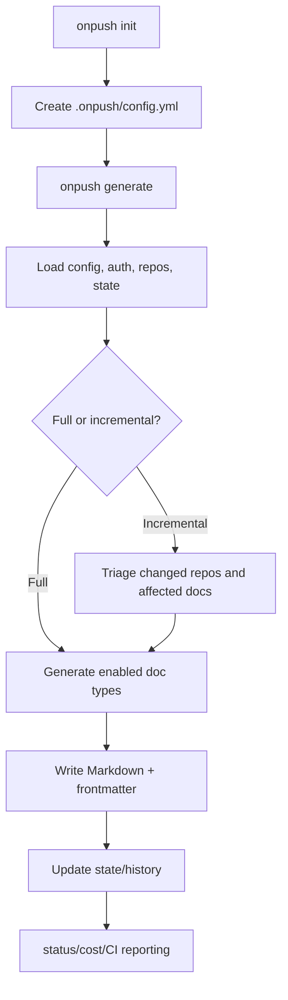

# Product Overview

## Table of Contents
- [Purpose](#purpose)
- [Key Features](#key-features)
  - [CLI Workflow and Lifecycle Commands](#cli-workflow-and-lifecycle-commands)
  - [AI-Driven Documentation Generation](#ai-driven-documentation-generation)
  - [Incremental Updates and Cost Controls](#incremental-updates-and-cost-controls)
  - [Repository Modes and Source Coverage](#repository-modes-and-source-coverage)
  - [Output and Automation Support](#output-and-automation-support)
- [Target Audience](#target-audience)
- [How It Works](#how-it-works)
  - [High-Level Flow](#high-level-flow)
  - [Generation Behavior](#generation-behavior)
- [Technology Stack](#technology-stack)
- [Project Structure](#project-structure)

## Purpose
OnPush (`onpush` CLI package) is an AI-assisted documentation generator for software repositories. It is designed to reduce the manual effort of creating and maintaining core engineering docs (product overview, architecture, API reference, testing, security, and more) while keeping docs aligned with code changes over time.

Its core value proposition is:
- turn documentation from a one-off writing task into a repeatable CLI/CI workflow,
- support multiple agent backends (Anthropic, Copilot, OpenCode) so teams can use existing tooling,
- and minimize rework through incremental regeneration rather than rewriting everything each run.

Primary references: `README.md`, `src/cli/index.ts:17`, `src/core/document-types.ts:19`.

## Key Features

### CLI Workflow and Lifecycle Commands
OnPush exposes a command-based developer workflow:
- `init`: interactive setup wizard for `.onpush/config.yml` (`src/cli/commands/init.ts:10`)
- `generate`: full or incremental doc generation (`src/cli/commands/generate.ts:19`)
- `types`: manage default/custom document types (`src/cli/commands/types.ts:9`)
- `status`: show generation/repo status (`src/cli/commands/status.ts:9`)
- `cost`: show historical generation cost data (`src/cli/commands/cost.ts:6`)
- `clean` and `deinit`: remove generated outputs and/or configuration (`src/cli/commands/clean.ts:7`, `src/cli/commands/deinit.ts:7`)

### AI-Driven Documentation Generation
Generation is provider-agnostic behind a shared provider interface (`src/generation/providers/types.ts:5`) and currently supports:
- Anthropic (`src/generation/providers/anthropic.ts`)
- GitHub Copilot (`src/generation/providers/copilot.ts`)
- OpenCode (`src/generation/providers/opencode.ts`)

Document generation uses system prompts tailored per document type (`src/generation/prompts/system.ts:40`) and built-in default type definitions (`src/core/document-types.ts:19`).

### Incremental Updates and Cost Controls
A key product capability is incremental documentation maintenance:
- state is persisted in `.onpush/state.json` (`src/core/state.ts:56`)
- repo commit SHAs are tracked to detect changes (`src/repos/manager.ts:115`)
- a triage pass can decide which doc types are affected (`src/generation/orchestrator.ts:483`)
- generation can stop when cost thresholds are exceeded (`src/generation/orchestrator.ts:234`, `src/cli/commands/generate.ts:74`)

This allows teams to avoid regenerating unaffected docs on every run.

### Repository Modes and Source Coverage
OnPush supports two operating modes:
- **Current repo mode**: document the repository where OnPush is configured
- **Remote repos mode**: document one or more repositories from paths, URLs, or GitHub shorthand

Repository resolution and clone/update behavior are managed by `src/repos/manager.ts`, `src/repos/local.ts`, and `src/repos/remote.ts`.

### Output and Automation Support
Generated docs are written as Markdown with frontmatter (`src/output/writer.ts:16`, `src/output/frontmatter.ts`) and can optionally be merged into a single consolidated file (`src/output/merger.ts`, invoked from `src/cli/commands/generate.ts:268`).

CI usage is explicitly supported (`README.md`, `.github/workflows/generate-docs.yml`) with JSON output mode for machine-readable summaries (`src/cli/commands/json-output.ts`, `src/cli/commands/generate.ts:331`).

## Target Audience
Primary users are engineering teams that need accurate, maintainable codebase documentation without large manual overhead.

### Primary Personas
- **Developers and maintainers**: run `onpush generate` during feature work to keep docs current.
- **Tech leads / architects**: maintain consistent cross-cutting docs (architecture, security, testing) across one or many repos.
- **Platform/DevOps engineers**: integrate doc generation into CI pipelines for automated updates.
- **Consultants or onboarding engineers**: quickly produce a structured understanding of unfamiliar codebases.

## How It Works

### High-Level Flow

### Generation Behavior
At a product level, generation follows this approach:
1. Read project configuration and environment/flag overrides (`src/core/config.ts`, `src/core/env.ts`).
2. Resolve authentication based on selected provider (`src/core/auth.ts`).
3. Resolve local/remote repositories and detect changes from previous generation (`src/repos/manager.ts`).
4. For incremental runs, optionally triage to decide which document types need updates (`src/generation/orchestrator.ts:139`).
5. Run document agents (sequentially or in parallel), collect results and costs (`src/generation/orchestrator.ts`).
6. Persist documents and generation metadata for future incremental runs (`src/output/writer.ts`, `src/core/state.ts`).

In short: OnPush uses AI agents to inspect code and produce docs, but wraps that capability in a deterministic CLI workflow (config, state, repo sync, and output management) so it is usable in day-to-day engineering operations.

## Technology Stack

| Area | Technology | Why it is used |
|---|---|---|
| Runtime | Node.js 20+ | CLI distribution and ecosystem compatibility (`package.json:24`) |
| Language | TypeScript | Type-safe command/config/orchestration logic (`tsconfig.json`) |
| CLI framework | Commander | Structured command and option parsing (`src/cli/index.ts:1`) |
| Validation | Zod | Strict config/state schema validation (`src/core/config.ts:1`, `src/core/state.ts:1`) |
| Config format | YAML | Human-editable project configuration (`src/core/config.ts:4`) |
| Git integration | simple-git | Repo checks, diffs, commit tracking, clone/update (`src/repos/remote.ts:1`, `src/git/diff.ts:1`) |
| AI providers | Claude Agent SDK, Copilot SDK, OpenCode SDK | Pluggable agent execution backends (`package.json:38`, `package.json:40`, `package.json:42`) |
| UX | Chalk, Clack prompts | Colored terminal output and interactive setup flows (`src/cli/commands/init.ts`, `src/cli/commands/types.ts`) |
| Testing | Vitest | Unit tests and coverage thresholds (`vitest.config.ts`) |

## Project Structure

Top-level layout (from repository root):

| Path | Purpose |
|---|---|
| `src/bin/` | Executable entrypoint (`onpush`) that boots the CLI |
| `src/cli/` | Command registration and user-facing command handlers |
| `src/core/` | Config, auth, environment overrides, errors, and state management |
| `src/generation/` | Orchestration pipeline, provider adapters, prompts, and agent tooling |
| `src/repos/` | Local/remote repository resolution and synchronization |
| `src/git/` | Git utility functions (history, diff, repo checks) |
| `src/output/` | Markdown writing, frontmatter generation, and single-file merge logic |
| `src/types/` | Local type declarations for external SDK compatibility |
| `scripts/` | Utility scripts (e.g., postinstall compatibility patch) |
| `.github/workflows/` | CI/CD automation examples and project workflows |
| `README.md` | User-facing product usage guide and command reference |
| `dist/` | Compiled output for distribution |

Source map for newcomers:
- Start at `src/bin/onpush.ts` -> `src/cli/index.ts` for command entry.
- Follow `src/cli/commands/generate.ts` for the main product behavior.
- Use `src/generation/orchestrator.ts` to understand the generation lifecycle.
- Use `src/core/config.ts` and `src/core/state.ts` to understand persistence and repeatability.
