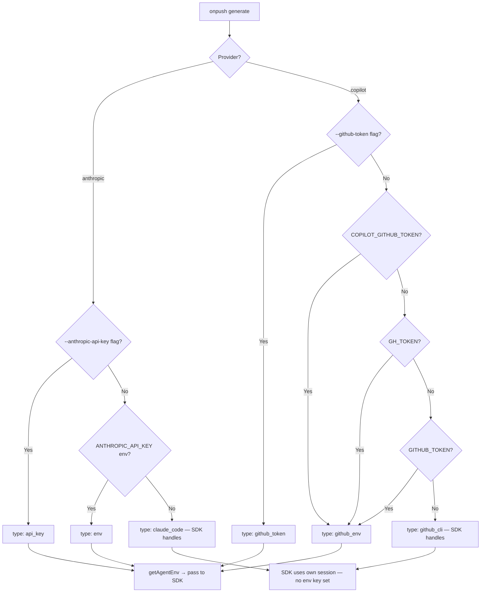

# Security

## Table of Contents

- [Authentication](#authentication)
  - [Anthropic Provider Authentication](#anthropic-provider-authentication)
  - [GitHub Copilot Provider Authentication](#github-copilot-provider-authentication)
  - [Authentication Resolution Flow](#authentication-resolution-flow)
  - [Agent Environment Propagation](#agent-environment-propagation)
- [Authorization](#authorization)
  - [No Multi-User Access Control](#no-multi-user-access-control)
  - [Agent Tool Permissions](#agent-tool-permissions)
- [Data Protection](#data-protection)
  - [Credentials in Transit](#credentials-in-transit)
  - [Data at Rest](#data-at-rest)
  - [State File Contents](#state-file-contents)
  - [Atomic State Writes and File Locking](#atomic-state-writes-and-file-locking)
- [Secrets Management](#secrets-management)
  - [API Keys and Tokens](#api-keys-and-tokens)
  - [BYOK (Bring Your Own Key) Credentials](#byok-bring-your-own-key-credentials)
  - [Environment Variable Priority Order](#environment-variable-priority-order)
  - [Secret Exclusion from Codebase Analysis](#secret-exclusion-from-codebase-analysis)
- [Input Validation](#input-validation)
  - [Configuration Validation with Zod](#configuration-validation-with-zod)
  - [Git URL Validation](#git-url-validation)
  - [Git Ref Validation](#git-ref-validation)
  - [Custom Type Slug Validation](#custom-type-slug-validation)
  - [Output Path Traversal Prevention](#output-path-traversal-prevention)
  - [Filename Template Validation](#filename-template-validation)
- [Security Headers & Middleware](#security-headers--middleware)
- [Dependency Security](#dependency-security)
  - [Direct Runtime Dependencies](#direct-runtime-dependencies)
  - [Auditing Dependencies](#auditing-dependencies)

---

## Authentication

onpush-cli is a local CLI tool that delegates AI workloads to either the Anthropic API (via the Claude Agent SDK) or GitHub Copilot (via the Copilot SDK). Authentication is resolved at startup for the chosen provider and then forwarded as environment variables to the underlying AI SDK—credentials are never stored on disk by onpush itself.

### Anthropic Provider Authentication

Implemented in [`src/core/auth.ts`](../src/core/auth.ts) — `resolveAuth()`.

The Anthropic authentication chain (highest to lowest priority):

| Priority | Source | Mechanism |
|----------|--------|-----------|
| 1 | `--anthropic-api-key <key>` CLI flag | Explicit at invocation |
| 2 | `ANTHROPIC_API_KEY` environment variable | Standard env injection |
| 3 | Active Claude Code session | SDK handles automatically when no key is provided |

When resolved via CLI flag or environment variable, the key is held in memory and passed directly to the Agent SDK. When falling back to a Claude Code session, no API key is held by onpush at all — the SDK manages the session token.

### GitHub Copilot Provider Authentication

Implemented in [`src/core/auth.ts`](../src/core/auth.ts) — `resolveCopilotAuth()`.

The Copilot authentication chain (highest to lowest priority):

| Priority | Source | Mechanism |
|----------|--------|-----------|
| 1 | `--github-token <token>` CLI flag | Explicit at invocation |
| 2 | `COPILOT_GITHUB_TOKEN` environment variable | Copilot-specific token |
| 3 | `GH_TOKEN` environment variable | General GitHub CLI token |
| 4 | `GITHUB_TOKEN` environment variable | GitHub Actions standard token |
| 5 | GitHub CLI / Copilot CLI stored credentials | SDK handles automatically |

### Authentication Resolution Flow



### Agent Environment Propagation

`getAgentEnv()` in [`src/core/auth.ts`](../src/core/auth.ts) converts an `AuthResult` into a minimal environment dictionary. Only the key relevant to the chosen provider is included:

- Anthropic: `{ ANTHROPIC_API_KEY: "<value>" }` — only when an explicit key was resolved
- Copilot: `{ COPILOT_GITHUB_TOKEN: "<value>" }` — only when a token was resolved
- Session-based auth: empty object `{}`

This dictionary is merged on top of the current `process.env` when spawning the agent, rather than globally mutating `process.env`. This prevents credential leakage to unrelated subprocesses.

---

## Authorization

### No Multi-User Access Control

onpush-cli is a single-user local tool. There is no concept of users, roles, or access control lists. The process inherits the file-system permissions of the user who invoked it. Authorization is entirely delegated to the operating system.

### Agent Tool Permissions

The Anthropic provider agent (in [`src/generation/agent.ts`](../src/generation/agent.ts)) is configured with a restricted toolset:

```typescript
disallowedTools: [
  "Write",
  "Edit",
  "MultiEdit",
  "NotebookEdit",
  "Agent",
  "TodoWrite",
],
```

This explicitly prevents the AI agent from writing to, editing, or spawning sub-agents within the target codebase. The agent may only **read** — write operations are solely performed by onpush's own output pipeline after the agent finishes. The Copilot provider similarly exposes only `list_repos` and `save_document` custom tools; it has no native file-write access.

The `list_repos` MCP tool (in [`src/generation/tools/repos-tool.ts`](../src/generation/tools/repos-tool.ts)) is declared with `{ annotations: { readOnly: true } }`, signaling to the SDK that it has no side effects.

---

## Data Protection

### Credentials in Transit

All network communication from onpush itself occurs via HTTPS:

- **Anthropic API** — the Claude Agent SDK communicates over TLS-encrypted HTTPS.
- **GitHub Copilot API** — the Copilot SDK communicates over TLS-encrypted HTTPS.
- **Remote repository cloning** — the default `github:` shorthand resolves to `https://github.com/<org>/<repo>.git`. SSH (`git@`) and explicit `https://` URLs are also supported. All allowed protocols (https, http, ssh, git@) are enforced by the URL allowlist described in [Input Validation](#input-validation).

No custom TLS pinning or certificate overrides are applied — standard platform certificate stores are used.

### Data at Rest

onpush does not encrypt any data it writes to disk. Files written by onpush include:

| Path | Contents | Sensitivity |
|------|----------|-------------|
| `.onpush/config.yml` | Project config (no secrets by design) | Low |
| `.onpush/state.json` | Commit SHAs, timestamps, cost metadata | Low |
| `.onpush/cache/<repo>/` | Full git clone of remote repos | Depends on repo content |
| `docs/<slug>.md` | Generated Markdown documentation | Low |

API keys and tokens are **never written to disk** by onpush. The `config.yml` schema intentionally does not include a top-level credentials section for Anthropic or GitHub tokens — these are always resolved from CLI flags or environment variables at runtime.

> **Note:** The BYOK `api_key` field in `config.yml` under `generation.copilot_byok` is an exception — a BYOK API key _may_ be stored in the config file. Users should treat `.onpush/config.yml` with the same care as any file containing API credentials if BYOK is configured, and ensure it is excluded from version control (`.gitignore`).

### State File Contents

`.onpush/state.json` stores generation metadata only:

```json
{
  "version": 1,
  "mode": "current",
  "lastGeneration": { "timestamp": "...", "model": "...", "totalCostUsd": 0.0, ... },
  "repositories": { "my-project": { "lastCommitSha": "abc123", "lastAnalyzedAt": "..." } },
  "documents": { "security": { "version": 1, "costUsd": 0.0, ... } },
  "history": [...]
}
```

No source code, documentation content, or credentials are stored in the state file.

### Atomic State Writes and File Locking

State persistence in [`src/core/state.ts`](../src/core/state.ts) uses two protection mechanisms:

1. **Atomic write** — the state is written to a `.tmp` file first, then renamed into place. On POSIX systems, `rename()` is atomic, preventing partial writes from corrupting the state file.
2. **Advisory file lock** — a `.lock` directory is created via `mkdir()` (atomic on all platforms) before writing. Stale locks older than 30 seconds are automatically removed. This prevents concurrent onpush processes from corrupting state during parallel CI runs.

---

## Secrets Management

### API Keys and Tokens

onpush uses a clear precedence hierarchy (CLI flag → environment variable → SDK-managed session) and never prompts the user to enter credentials interactively, nor stores them in config files (with the BYOK exception noted above).

**Recommended patterns per environment:**

| Environment | Recommended method |
|-------------|-------------------|
| Local development (Anthropic) | Claude Code session (no key required) |
| Local development (Copilot) | GitHub CLI stored credentials |
| CI/CD pipelines | `ANTHROPIC_API_KEY` or `GITHUB_TOKEN` as repository secrets |
| Automated tooling | Environment variables injected at runtime |

**CI example (GitHub Actions):**

```yaml
- run: onpush generate
  env:
    ANTHROPIC_API_KEY: ${{ secrets.ANTHROPIC_API_KEY }}
```

API keys should **never** be passed as CLI flags in CI environments, as flags may be visible in process lists or logs.

### BYOK (Bring Your Own Key) Credentials

The optional BYOK configuration for the Copilot provider supports an `api_key` field in `config.yml`. Alternatively, this can be supplied via:

- `--byok-api-key <key>` CLI flag
- `ONPUSH_BYOK_API_KEY` environment variable

The precedence order is: CLI flag → environment variable → config file value. Prefer environment variables over config file storage for BYOK API keys.

### Environment Variable Priority Order

Full environment variable reference for secrets:

| Variable | Provider | Priority |
|----------|----------|----------|
| `ANTHROPIC_API_KEY` | Anthropic | 2nd (after `--anthropic-api-key` flag) |
| `COPILOT_GITHUB_TOKEN` | Copilot | 2nd (after `--github-token` flag) |
| `GH_TOKEN` | Copilot | 3rd |
| `GITHUB_TOKEN` | Copilot (also used by git for private repo cloning) | 4th |
| `ONPUSH_BYOK_API_KEY` | Copilot BYOK | 2nd (after `--byok-api-key` flag) |

### Secret Exclusion from Codebase Analysis

The default `exclude` patterns in [`src/core/config.ts`](../src/core/config.ts) prevent the AI agent from reading common secrets files in the target repository:

```typescript
exclude: z.array(z.string()).default([
  "node_modules/**",
  "dist/**",
  "build/**",
  ".git/**",
  "**/*.lock",
  "**/*.min.js",
  ".env*",           // .env, .env.local, .env.production, etc.
  "**/credentials*", // credentials.json, AWS credentials, etc.
  "**/secrets*",     // secrets.yaml, secrets.ts, etc.
  "**/*.pem",        // TLS certificates
  "**/*.key",        // Private keys
]),
```

These patterns are applied in [`src/git/files.ts`](../src/git/files.ts) via `minimatch` before the file list is handed to the agent. Files matching any pattern are excluded from the agent's view of the repository. Users should review and extend these patterns for their specific secret file conventions.

---

## Input Validation

### Configuration Validation with Zod

All configuration is validated at load time using [Zod](https://zod.dev/) schemas in [`src/core/config.ts`](../src/core/config.ts). The schema enforces types, ranges, and allowed values before any processing begins. Invalid configuration raises a `ConfigError` with a human-readable message listing all failing fields.

Key validated fields:

| Field | Constraint |
|-------|-----------|
| `generation.provider` | Enum: `"anthropic"` or `"copilot"` |
| `generation.cost_limit` | Positive number or null |
| `generation.timeout` | Positive number |
| `generation.parallel` | Positive integer |
| `output.filename_template` | Must not contain `..` or start with `/` |
| `output.directory` | String |
| `repository.path / url / github` | Exactly one must be provided |

### Git URL Validation

Remote repository URLs are validated in [`src/repos/remote.ts`](../src/repos/remote.ts) — `validateGitUrl()` — before any clone or fetch operation:

```typescript
const ALLOWED_URL_PATTERNS = [
  /^https:\/\//,
  /^http:\/\//,
  /^git@[a-zA-Z0-9._-]+:/,
  /^ssh:\/\//,
];
```

Any URL not matching one of these patterns is rejected with an error. This specifically blocks Git's dangerous `ext::` protocol, which can be abused for arbitrary command execution (e.g., `ext::sh -c "malicious-command"`), as well as `file://` and other unexpected protocols.

### Git Ref Validation

Branch and tag names (the `ref` field in repository specs) are validated against a safe character set before being passed to git:

```typescript
const SAFE_REF_PATTERN = /^[a-zA-Z0-9._\-/]+$/;
```

This prevents command injection via ref names containing shell metacharacters (e.g., `; rm -rf /`). The test suite in [`src/repos/__tests__/remote.test.ts`](../src/repos/__tests__/remote.test.ts) verifies rejection of such inputs.

### Custom Type Slug Validation

Custom document type slugs are constrained by a safe pattern to prevent filesystem or URL manipulation:

```typescript
const SafeSlugPattern = /^[a-z0-9]+(?:-[a-z0-9]+)*$/;
```

Only lowercase alphanumeric characters and hyphens are permitted, blocking path traversal or injection attempts via slug values.

### Output Path Traversal Prevention

The document writer in [`src/output/writer.ts`](../src/output/writer.ts) performs an explicit path traversal check before writing any file:

```typescript
if (!filePath.startsWith(resolvedOutputDir + "/") && filePath !== resolvedOutputDir) {
  throw new Error(
    `Path traversal detected: resolved path "${filePath}" escapes output directory "${resolvedOutputDir}"`
  );
}
```

This guards against a malicious `filename_template` value (e.g., `../../etc/passwd`) bypassing the Zod `..` check at the schema level and reaching the filesystem.

### Filename Template Validation

The `filename_template` config field is validated by the Zod schema to ensure it neither contains `..` nor starts with `/`:

```typescript
.refine(
  (t) => !t.includes("..") && !t.startsWith("/"),
  "filename_template must not contain '..' or start with '/'"
)
```

This is complemented by the runtime path traversal check in the writer for defence-in-depth.

---

## Security Headers & Middleware

onpush-cli is a command-line tool with no HTTP server component. Concepts such as CORS headers, Content Security Policy, rate limiting, and CSRF protection do not apply. All inter-process communication is either:

- **Stdio** — between onpush and the Anthropic/Copilot SDK subprocess
- **HTTPS** — between the SDK and remote APIs, managed entirely by the respective SDKs

There is no web server, no exposed port, and no HTTP middleware pipeline.

---

## Dependency Security

### Direct Runtime Dependencies

| Package | Purpose | Security Relevance |
|---------|---------|-------------------|
| `@anthropic-ai/claude-agent-sdk` | Anthropic AI agent runner | Handles API key auth and HTTPS comms with Anthropic |
| `@github/copilot-sdk` | GitHub Copilot agent runner | Handles GitHub token auth and Copilot API comms |
| `zod` | Schema validation | Used for all config and state validation |
| `simple-git` | Git operations | Used for repo clone/update/diff; receives validated URLs and refs only |
| `minimatch` | Glob pattern matching | Used for exclude pattern filtering |
| `yaml` | YAML parsing/serialisation | Used for config file I/O |
| `commander` | CLI argument parsing | No network exposure |
| `chalk` | Terminal colour | No network exposure |
| `@clack/prompts` | Interactive TUI prompts | No network exposure |

### Auditing Dependencies

Run a dependency audit at any time:

```bash
npm audit
```

This checks all installed packages against the npm advisory database. Address `high` and `critical` severity vulnerabilities promptly.

To check for outdated packages:

```bash
npm outdated
```

**postinstall note:** The `scripts/postinstall.mjs` script patches `vscode-jsonrpc/package.json` exports at install time to add missing entrypoints required by the Claude Agent SDK. This script only modifies the `exports` field of that package's manifest and does not fetch remote content or execute arbitrary code.

There is currently no automated dependency update tooling (e.g., Dependabot or Renovate) configured in the repository. Contributors should periodically run `npm audit` and update vulnerable dependencies, submitting pull requests against the `next` development branch per the contribution guidelines.

